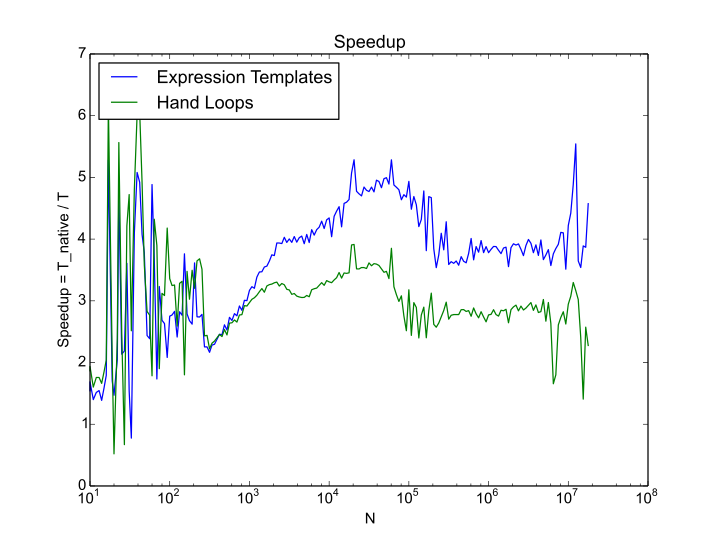

# ExpressionTemplates

Linux, OSX: 

This package provides Julia with deferred evaluation of array expressions using a C++-style Expression Template framework.
The purpose of the package is to greatly accelerate the evaluation of
vectorized expressions by eliminating allocation of intermediate calculations.
For example, for scalar a, b, c, d, and length-N vectors A, B, C, D, the expression
**R = \alpha A + \beta B + \gamma C + \delta D**
requires the construction of *seven* temporary arrays.
A more optimal way to compute this is to allocate an output array
and compute the result index-by-index.
Expression templates exploit the language's type system to do precisely this, thus
avoiding the overhead of intermediate array allocations.

For this model problem, I have found peak speedups of 5.25x over the native array evaluation,
while a simple hand-coded loop, such as the one described above, only achieves 4x (on my machine).
The benchmark showing the speedup of expression templates vs a hand-coded loop is shown in the image.

